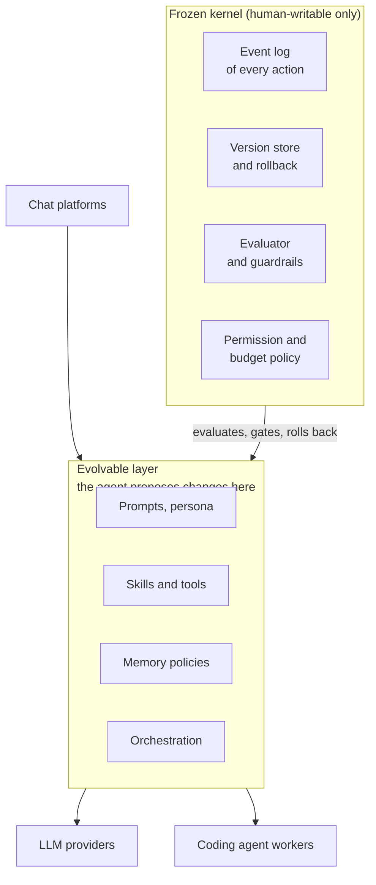

# Self-Improving Social Agent Harness: Design Doc

## Ultimate goal

An AI persona that lives in group and private chats over the long term and keeps getting better at being a trusted, welcome member of those communities. It learns each person over time, remembers and forgets the way a good friend would, and improves its own behavior and its own harness from real interaction, while staying safely under its operator's control.

**What that means**

- **Long-term relationships:** a coherent, evolving understanding of each person across every chat, with privacy respected.
- **Self-improvement, including its own harness:** it proposes changes to its prompts, skills, tools and orchestration, and only changes that prove better in real use stay.
- **Safe autonomy:** broad freedom in its own environment, with a small frozen core that it cannot change judging and limiting it.
- **The operator stays in control:** it runs on the operator's own hardware, and everything it does can be audited.

**Non-goals (for now)**

- Benchmark-based evaluation that burns tokens on synthetic suites. Feedback from real use is slow, and that is acceptable.
- Multi-tenant hosting and large-scale deployment. Design for one deployment first.

## Requirements

**Functional**

- **Conversation:** takes part in many group and private chats at once, on Telegram first through a userbot, and speaks proactively as well as when addressed.
- **People memory:** remembers each person across chats, with the source of every fact recorded and private information never surfacing in the wrong chat.
- **Self-improvement:** proposes changes to its prompts, skills, tools, orchestration and memory policy, tests them on real interactions, and can roll any of them back.
- **Delegation:** hands heavy or long-running work to external coding agents and gets back reviewed results.
- **Operator control:** the super admin can inspect, approve, limit and roll back what the agent does, through a dashboard or a verified chat.

**Constraints**

- **Hardware:** runs on modest local machines (an 8 GB Mac mini plus a 32 GB box), in containers.
- **Safety:** a frozen kernel the agent cannot edit, limits on who it may message, and no access to raw secrets.
- **Auditability:** every action is logged with the harness version that produced it.
- **Cost:** no benchmark suites; evaluation comes from real interactions and a small judged sample.
- **Languages:** Chinese and English.

## Key decisions

These are the decisions that shape the design. Everything smaller is deferred to implementation (last section).

| Decision | Choice | Why |
| --- | --- | --- |
| Build approach | Our own small kernel; borrow ideas only | DeepSeek Harness is heavy, cannot lock parts of its plugin tree, and changes fast |
| Kernel boundary | A frozen kernel in a separate supervisor process; the agent changes only the evolvable layer | An in-process plugin tree cannot enforce a boundary, and the agent must not edit its own judge |
| Memory model | Immutable event log as the source of truth; claims with a lifecycle; graph-style links; versioned persona projections | Rebuildable, traceable and correctable, and it supports cross-chat association |
| Forgetting | Decay accessibility by claim type; archive instead of delete | Avoids stale facts without losing history |
| Storage | SQLite with keyword and vector search; Postgres as the scale-out path | One auditable file that is easy to snapshot |
| Evaluation | Online, from real interactions: canary rollout, guardrail metrics, a sampled judge, a charter set by the super admin | No benchmark token cost; slow feedback is acceptable |
| Delegation | External coding agents behind one interface, in isolated workspaces, with review before anything lands | We do not build a coding agent, and the blast radius stays small |
| Sandbox | Full control inside the container; limits are structural (supervisor split, read-only kernel, brokered secrets), with no command blocklist | The real risks are secrets, outward actions and tampering with the judge |
| Outward messages | Trust tiers: whitelisted people unlimited; others capped, with an aggregate cap that a human can set to 0; a blacklist; all enforced by the supervisor | Social harm is the main risk of an agent that talks to people |
| Authority | The super admin approves kernel changes and edits the lists, through authenticated channels and never through the agent | Prevents impersonation and self-approval |
| First platform | Telegram, through a userbot on a dedicated account | Matches the existing setup |

## Architecture

The system splits into a small frozen kernel that only humans can change and an evolvable layer that the agent may propose changes to.

The agent can change only what is in the evolvable layer; the kernel records everything, scores changes, and can roll them back.

**Build versus adopt.** We lean toward building a small kernel of our own and borrowing ideas and selected parts, not forking dsh as the base. A read-only spike of dsh confirmed this.

- The kernel must be small enough to audit. DeepSeek Harness has no privileged core and no way to lock part of its plugin tree, and its plugins run in one process.
- Its inputs are workspace-shaped, it has no chat-platform adapters, and it changes very fast.
- We borrow ideas: log everything the model sees, deny-only guards, inbox and follow-up handling, and versioned session formats. It can still serve as one of the coding workers.

## Memory framework

Memory is the most important component: an immutable event log is the source of truth, and everything else is a rebuildable projection over it.

1. **Event log.** Immutable observations (messages, actions, outcomes), each tagged with the harness version that produced it. Facts, profiles and summaries can be regenerated from it when extraction improves, and a new memory policy can be tested by replaying history.
2. **Claims with a lifecycle.** A claim has a subject, predicate, object, valid-from and valid-to, evidence links, a trust level, and a status: proposed, verified, contradicted, superseded or retired. New evidence supersedes old claims instead of overwriting them.
3. **Graph-style model.** Nodes: person, account, chat, topic, claim, episode, and the agent. Edges are typed and time-bounded (`account_of`, `member_of`, `participated_in`, `mentioned`, `about`, `supports`, `contradicts`, `supersedes`, `related_to`). Cross-chat association is mostly one to three hops.
4. **Persona as a projection.** Each person has a versioned persona document generated from verified claims, with links back to supporting claims, marked for uncertainty. Old versions are kept so drift can be inspected and rolled back.
5. **Write gating and trust.** Every memory records its producer and source trust. Chat messages, web pages and the agent's own inferences do not carry equal weight, and low-trust content never becomes a durable fact or an instruction to the improver without verification.
6. **Forgetting and summaries.** Decay by recency, use and importance; archive instead of delete; summaries keep lineage to the items they cover, with a drill-down path.
7. **Privacy.** Visibility and sensitivity live on each claim and edge and are enforced at query time, so something learned in a private chat cannot surface in a group unless its scope allows. Identity merges need evidence and must be reversible. People can view, correct and delete what is known about them.
8. **Retrieval.** Combine keyword search, vector search and structured filters (person, chat, time, claim status), then rerank. Log which memories were retrieved and whether they helped, so retrieval can improve from outcomes.
9. **Memory policies are evolvable.** Extraction, consolidation and retrieval are versioned modules that the improvement loop can change, tested against replayed history.

### Memory tiers and rollout plan

Memory is split into short-term, mid-term and long-term tiers, built up in phases so each phase can be measured before the next one starts.

| Tier | Holds | Lifetime | Written by | Read by |
| --- | --- | --- | --- | --- |
| Short-term | Current context window: recent messages of the chat, the active task, a rolling summary of this chat | One conversation or task | The loop, automatically | Always in the prompt |
| Mid-term | Recent episodes, per-chat and per-person working notes, unconsolidated candidate claims | Days to weeks, then consolidated or decayed | Extraction after each session, with provenance | Retrieved by the agent through memory tools |
| Long-term semantic | Verified claims, the entity graph, persona documents | Until superseded or retired | The consolidation job (sleep-time) | Retrieved by claim, person or chat, filtered by visibility |
| Long-term procedural | Skills, playbooks, what worked and what did not | Versioned like other harness changes | The improvement loop | Loaded by the harness |

Research suggests structured claim stores handle changing facts better than pure embedding retrieval, and that where an LLM sits in the memory pipeline decides which failures are recovered. We test these choices on real data during implementation.

**Phases**

1. **Foundation.** Event log, harness-version tagging, outcome records, and a memory scorecard from real use: was a retrieved memory used, was it later corrected, and how many tokens did it cost.
2. **Short-term and mid-term.** Rolling per-chat summary, an episode store with provenance, and a structured claim store. Retrieval is FTS plus vectors plus filters. Start with structured claims first, since the research favors them over pure embeddings.
3. **Consolidation (sleep-time).** A scheduled job that merges duplicates, supersedes outdated claims, decays by use and recency, archives instead of deleting, and generates persona versions. Use deterministic rules for time and lexical matching, and an LLM at mutation time for updates and deletions.
4. **Graph and cross-chat.** Entity and identity linking with evidence, typed time-bounded edges, and visibility enforced at query time.
5. **Memory as tools.** Give the agent search, remember, correct and forget tools, and compare against automatic pre-fetch on the scorecard before choosing.
6. **Evolve memory policy.** Treat extraction, consolidation and retrieval as versioned programs. Propose changes from failure diagnoses, test by replaying the log, and promote with the online signals from the evaluation section.

**Deleting a person's data.** This is a manual process handled by the super admin. Everything is stored locally and can be audited, and the system is not commercial. Provenance links stay in the schema so that everything tied to a person can be found with one query when a deletion is requested. Snapshots and backups may still contain the data until they are rotated, and text already sent to LLM or embedding API providers is outside our control.

### Forgetting and decay

Forgetting means lowering a memory's accessibility, not deleting it. Deleting data stays a separate, manual process.

| Claim type | Decay | Example |
| --- | --- | --- |
| Stable identity facts | None | Name, main language |
| Preferences and interests | Slow | Likes a game or a topic |
| Plans and events | Expire when the date passes | A trip next week |
| Moods and short-term status | Fast | Tired today, busy this week |
| Safety-relevant facts | Pinned, never decay | Allergies, boundaries a person asked for |

- **Reinforce on use.** A claim that is retrieved, used and not corrected gets a score boost, and a fresh mention resets its clock.
- **Decay affects rank and prompt inclusion, not existence.** Low-scoring claims move to an archive that a deliberate search can still find.
- **Check old facts, do not assume them.** When the agent uses an aged claim, it can phrase it as a question, which reduces stale-fact errors.
- **Relationship closeness decays separately.** A person with no recent interaction moves to a lower closeness tier, but facts about them are not erased because of it.
- **Rates are tunable.** They are part of the evolvable memory policy, tuned against the stale-fact and correction metrics. The starting rates are still to be chosen.

## Storage decisions

We use SQLite in WAL mode as the primary store, with FTS5 for keyword search and a vector extension such as sqlite-vec for embeddings.

| Decision | Choice | Reason |
| --- | --- | --- |
| Primary store | SQLite (WAL) | One file that is easy to back up, snapshot and fork for memory-policy experiments; no server to run |
| Keyword search | FTS5 | Built in |
| Vector search | sqlite-vec or similar, behind an interface | Embeddings in a separate table, recording the embedding model, since we will re-embed |
| Graph queries | Edge tables plus recursive CTEs | Most cross-chat queries are one to three hops at our scale |
| Graph database | Not now | Adds operations cost; revisit if queries need deep traversal or path-finding |
| Scale-out path | Postgres with pgvector | For multiple writers or hosted deployment; keep the schema portable and hide queries behind an interface |

Access goes through a small query interface (`neighbors`, `path`, `evidence_for`, `persona_inputs`), so the storage engine can change without touching the agents. Snapshot the database before each memory-policy experiment so a bad consolidation can be undone.

**Embeddings.** They sit behind an interface, with the model name and dimension stored on every vector. The model is chosen by a retrieval test on real Chinese and English chats, starting small and local.

## Self-improvement and evaluation

The agent proposes changes to its evolvable layer, and each change is judged by outcomes from real interactions, not by a synthetic benchmark. Slow feedback is acceptable.

**Signals**

- Implicit behavior: replies, conversation continuing, reactions, mutes, ignored messages, admin deletions.
- Explicit corrections from people. Rare but strong; every one is saved as a regression case.
- Task outcomes: completed, retried, timed out, errored; tool error rates.
- Cost and latency per action.
- A cheap LLM judge on a small sample of traces (about 1 to 5 percent), against a fixed rubric.

**Method**

1. Log a structured outcome record per action, tagged with the harness version.
2. Version every change as a patch in git. Keep an archive of variants with scores and lineage, and allow branching from any variant.
3. Run a candidate on a small slice of traffic, or in shadow mode where its output is logged but not sent.
4. Compare signals against the incumbent. Promote on a clear win with no guardrail regression; roll back automatically if a guardrail trips.
5. Replay logged decision points against a candidate, judging only a sample, as a cheap offline check.

**Guardrails:** complaints, mutes, safety violations and cost must not regress.

**Frozen kernel.** The evaluator, safety and permission policy, budget limits, rollback and the version store are writable by humans only. The agent never edits what judges it.

**Known risks:** slow feedback needs enough volume, so change one thing at a time; chat contexts differ, so compare within similar contexts; optimizing engagement can produce annoying behavior, so the definition of good is human-set; stored traces must go through privacy scrubbing. Always compare against a simple baseline such as more test-time compute.

### Persona quality charter (draft)

The super admin owns this charter. It lives in the frozen kernel, and the agent cannot edit it or the judge.

**Test persona.** For early testing only, a friendly, funny group-chat regular who is casual and likes anime and technology, has opinions of their own and does not just agree with everyone. It is a placeholder to replace with a proper persona description.

**Hard constraints** (pass or fail; any violation blocks promotion)

- Private information never appears in the wrong chat.
- No messages outside the whitelist and limit policy.
- No secrets or credentials in any message.
- Never claims to be human when asked directly.
- Stops when asked to stop.

**Guardrail metrics:** complaints, mutes, blacklist additions, corrections, cost and latency. None may regress.

**Soft goals**, judged by comparing the incumbent's reply with the candidate's:

| Dimension | Question the judge answers |
| --- | --- |
| Persona consistency | Does the voice and behavior fit the persona description? |
| Relevance | Does the reply fit the conversation and add something? |
| Timing | Did it speak when it should, and stay quiet when it should not? Are proactive messages spaced sensibly? |
| Warmth and naturalness | Does it read like a person and not a template? |
| Memory accuracy | Are remembered facts correct and used appropriately? |

**Judging setup:**

- Pairwise comparison of the incumbent's and the candidate's replies, with narrow questions per dimension.
- A cheap first-pass judge, with uncertain cases escalated to a stronger model, on a small sample of traffic.
- A judge from a different model family than the one writing replies.
- The super admin labels a batch of items periodically, and the judge's agreement with those labels is tracked.

## Delegation to coding agents

Coding agents are external workers behind one small interface, run in isolated workspaces, and their results return as structured data. We do not build a coding agent ourselves.

1. **One interface:** `delegate(task, workspace, policy)` returns a run id, with `status`, `cancel` and `result`. The backend is chosen per task.
2. **Isolation:** each task runs in its own throwaway container or git worktree on a branch. The output is a branch or diff, never edits to the live tree.
3. **Structured results:** outcome, summary, files changed, tests and cost. Full transcripts go to a log for the improver, not into the persona's context.
4. **Policy outside the worker:** permissions, network, timeout and spend cap are enforced by the launcher, and workers get no access to the persona's memory or credentials.
5. **Review before landing:** worker output is a proposed patch. Checks and the outcome evaluation run first, and the super admin approves anything that touches the frozen kernel.

## Sandbox and security boundaries

The agent gets full control of its own running environment inside a container. The limits are structural, not command filters, because a blocklist such as one for `rm -rf /` is easy to bypass and protects little that a snapshot restore does not.

**What Docker alone does not cover**

- Secrets: anything stored in the container is readable by the agent, and chat messages come from untrusted people, so prompt injection is realistic.
- Acting as the persona: the agent can message real people from a real account, so the damage can be social.
- Tampering with its own judge: if the evaluator, version store or event log is writable from inside, the kernel is not frozen.
- Escape paths: a mounted Docker socket, privileged mode, host mounts or broad capabilities.
- Network: unrestricted egress lets data leave and code arrive.

**Boundaries we build**

1. **Supervisor and agent split.** A small supervisor holds the kernel (evaluator, version store, event log, budget and permission policy). The agent runtime is a separate non-root container that reaches the kernel only through a narrow interface: append an event, propose a change, request a delegation.
2. **Read-only kernel.** Frozen components are mounted read-only or live outside the agent's container.
3. **Brokered secrets.** LLM and chat API calls go through a proxy or the supervisor, which injects credentials. The agent never sees a key.
4. **Container basics.** Non-root, no privileged mode, no Docker socket, dropped capabilities, and limits on CPU, memory, disk and processes.
5. **Egress control.** All outbound traffic is allowed to start with, and every request is logged. We can tighten to an allowlist later from what the logs show.
6. **Outward-action limits.** Tiered limits on who the agent may message, enforced by the supervisor. See the policy below.
7. **Snapshots and rollback.** Snapshot the agent's writable volume before risky work, stored outside its reach. This replaces a destructive-command guard.
8. **Isolated coding workers.** Each runs in its own throwaway container or worktree with no access to the persona's memory or credentials.

**Outward-action policy** (no human approval step; limits by trust tier)

- **Whitelisted people:** no limit.
- **Everyone else:** a per-person limit plus an aggregate limit across all non-whitelisted people, which a human can lower when away from keyboard.
- **Aggregate set to 0:** the agent stops interacting with non-whitelisted users, both in DMs and when directly mentioned in group chats.
- **Blacklist:** blocked people are never messaged or answered.
- **Enforcement:** the whitelist, blacklist and limits live in the supervisor, outside the agent's writable reach. Every send goes through it.

- **Editing the lists:** the whitelist and blacklist are edited on a web dashboard we expose, or by the super admin in a chat with the agent.
- **Super-admin chat edits:** the supervisor verifies the super admin's platform identity itself and applies the change. The agent relays the request but does not decide it, so a message that only claims to be the super admin cannot change the lists.
- **Cap at 0:** messages from non-whitelisted people that arrive while the cap is 0 are dropped, not queued.

**Left fully open to the agent:** its workspace, shell, packages, files, skills and tools, and the whole evolvable layer.

## Deferred to implementation

These are decided when we build them, not now.

- **Embedding model:** chosen by a retrieval test on real chats. Start with a small local model and an API as fallback.
- **Decay rates** for each claim type.
- **Feedback window and canary size:** set from real traffic. A week is the likely minimum.
- **Persona anchors:** the super admin writes the level scales and examples from real logs.
- **Coding-worker backends:** start with one, add others later.
- **Egress rules:** all traffic is allowed and logged at first, then tightened from the logs.
- **Dashboard and list details:** authentication, default limits, and how dropped messages are handled.
- **Per-person data deletion:** manual, done by the super admin on request.
